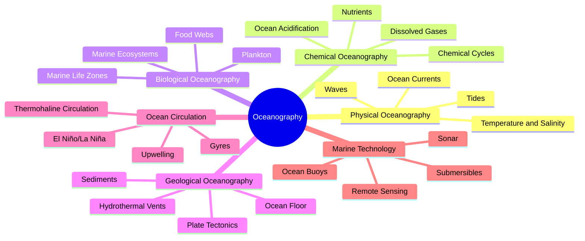

```mermaid
mindmap
  root((Oceanography))
    Physical Oceanography
      Ocean Currents
      Waves
      Tides
      Temperature and Salinity
    Chemical Oceanography
      Dissolved Gases
      Nutrients
      Ocean Acidification
      Chemical Cycles
    Biological Oceanography
      Marine Ecosystems
      Plankton
      Food Webs
      Marine Life Zones
    Geological Oceanography
      Ocean Floor
      Plate Tectonics
      Sediments
      Hydrothermal Vents
    Ocean Circulation
      Thermohaline Circulation
      Upwelling
      Gyres
      El Niño/La Niña
    Marine Technology
      Submersibles
      Remote Sensing
      Sonar
      Ocean Buoys
```

