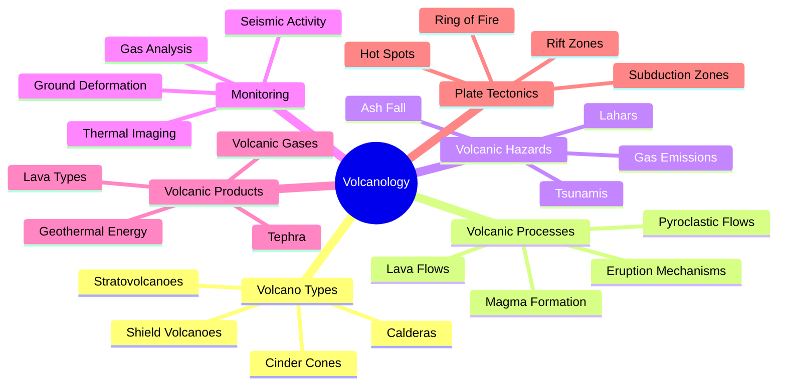

```mermaid
mindmap
  root((Volcanology))
    Volcano Types
      Shield Volcanoes
      Stratovolcanoes
      Cinder Cones
      Calderas
    Volcanic Processes
      Magma Formation
      Eruption Mechanisms
      Lava Flows
      Pyroclastic Flows
    Volcanic Hazards
      Ash Fall
      Lahars
      Gas Emissions
      Tsunamis
    Monitoring
      Seismic Activity
      Ground Deformation
      Gas Analysis
      Thermal Imaging
    Volcanic Products
      Lava Types
      Tephra
      Volcanic Gases
      Geothermal Energy
    Plate Tectonics
      Subduction Zones
      Rift Zones
      Hot Spots
      Ring of Fire
```

