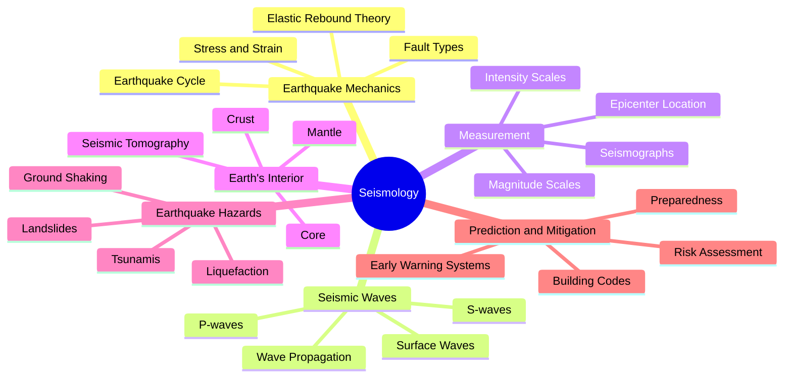

```mermaid
mindmap
  root((Seismology))
    Earthquake Mechanics
      Elastic Rebound Theory
      Fault Types
      Stress and Strain
      Earthquake Cycle
    Seismic Waves
      P-waves
      S-waves
      Surface Waves
      Wave Propagation
    Measurement
      Seismographs
      Magnitude Scales
      Intensity Scales
      Epicenter Location
    Earth's Interior
      Crust
      Mantle
      Core
      Seismic Tomography
    Earthquake Hazards
      Ground Shaking
      Liquefaction
      Tsunamis
      Landslides
    Prediction and Mitigation
      Early Warning Systems
      Building Codes
      Risk Assessment
      Preparedness
```

