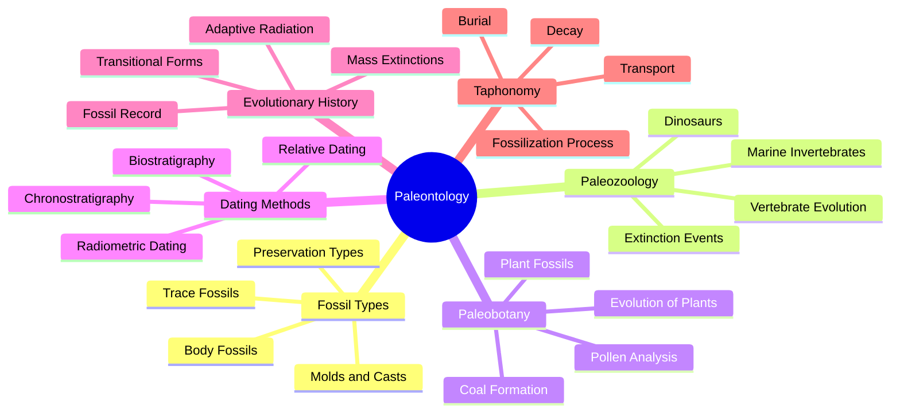

```mermaid
mindmap
  root((Paleontology))
    Fossil Types
      Body Fossils
      Trace Fossils
      Molds and Casts
      Preservation Types
    Paleozoology
      Dinosaurs
      Marine Invertebrates
      Vertebrate Evolution
      Extinction Events
    Paleobotany
      Plant Fossils
      Pollen Analysis
      Evolution of Plants
      Coal Formation
    Dating Methods
      Radiometric Dating
      Relative Dating
      Biostratigraphy
      Chronostratigraphy
    Evolutionary History
      Mass Extinctions
      Adaptive Radiation
      Fossil Record
      Transitional Forms
    Taphonomy
      Fossilization Process
      Decay
      Transport
      Burial
```

