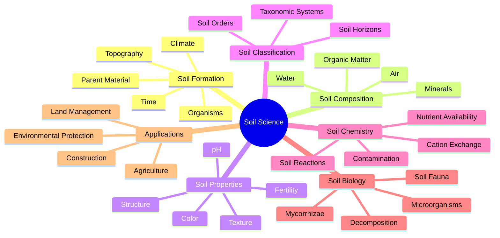

```mermaid
mindmap
  root((Soil Science))
    Soil Formation
      Parent Material
      Climate
      Organisms
      Topography
      Time
    Soil Composition
      Minerals
      Organic Matter
      Water
      Air
    Soil Properties
      Texture
      Structure
      pH
      Fertility
      Color
    Soil Classification
      Soil Orders
      Soil Horizons
      Taxonomic Systems
    Soil Chemistry
      Cation Exchange
      Nutrient Availability
      Soil Reactions
      Contamination
    Soil Biology
      Microorganisms
      Soil Fauna
      Decomposition
      Mycorrhizae
    Applications
      Agriculture
      Land Management
      Environmental Protection
      Construction
```

