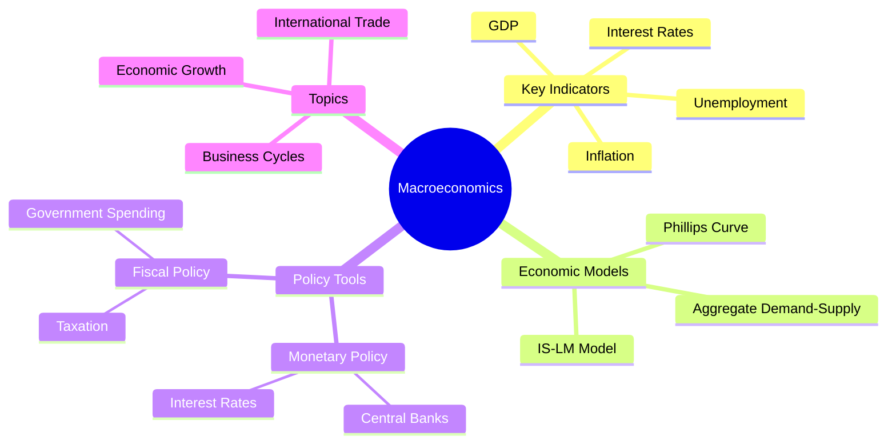

```mermaid
mindmap
  root((Macroeconomics))
    Key Indicators
      GDP
      Inflation
      Unemployment
      Interest Rates
    Economic Models
      Aggregate Demand-Supply
      IS-LM Model
      Phillips Curve
    Policy Tools
      Monetary Policy
        Central Banks
        Interest Rates
      Fiscal Policy
        Government Spending
        Taxation
    Topics
      Economic Growth
      Business Cycles
      International Trade
```

