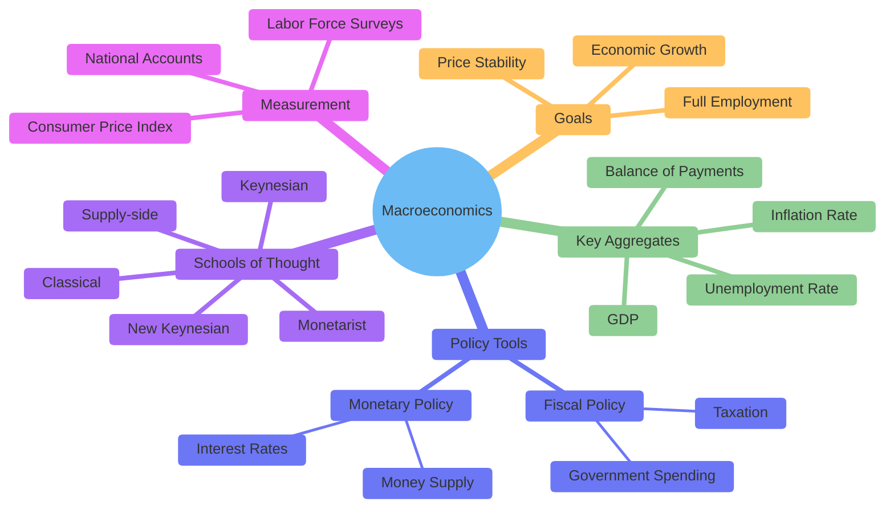

```mermaid
%%{init: {"theme": "base", "themeVariables": {
  "primaryColor": "#E3F2FD",
  "primaryTextColor": "#333",
  "primaryBorderColor": "#1565C0",
  "lineColor": "#4A6FA5",
  "secondaryColor": "#FFF3E0",
  "tertiaryColor": "#E8F5E9"
}}}%%
mindmap
  root((Macroeconomics))
    Goals
      Economic Growth
      Full Employment
      Price Stability
    Key Aggregates
      GDP
      Unemployment Rate
      Inflation Rate
      Balance of Payments
    Policy Tools
      Fiscal Policy
        Government Spending
        Taxation
      Monetary Policy
        Interest Rates
        Money Supply
    Schools of Thought
      Classical
      Keynesian
      Monetarist
      New Keynesian
      Supply-side
    Measurement
      National Accounts
      Consumer Price Index
      Labor Force Surveys
```

