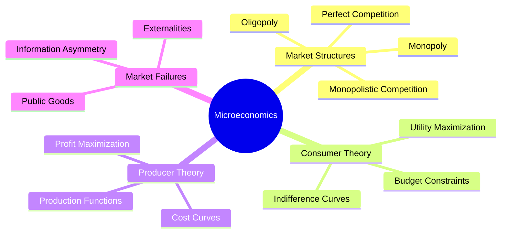

```mermaid
mindmap
  root((Microeconomics))
    Market Structures
      Perfect Competition
      Monopoly
      Oligopoly
      Monopolistic Competition
    Consumer Theory
      Utility Maximization
      Indifference Curves
      Budget Constraints
    Producer Theory
      Production Functions
      Cost Curves
      Profit Maximization
    Market Failures
      Externalities
      Public Goods
      Information Asymmetry
```

