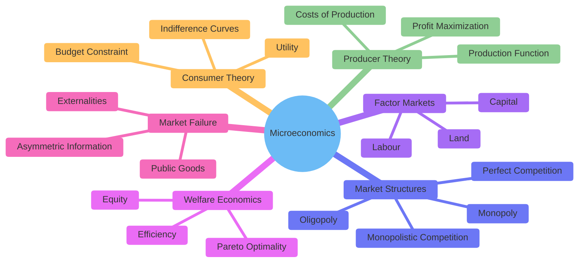

```mermaid
%%{init: {"theme": "base", "themeVariables": {
  "primaryColor": "#E3F2FD",
  "primaryTextColor": "#333",
  "primaryBorderColor": "#1565C0",
  "lineColor": "#4A6FA5",
  "secondaryColor": "#FFF3E0",
  "tertiaryColor": "#E8F5E9"
}}}%%
mindmap
  root((Microeconomics))
    Consumer Theory
      Utility
      Budget Constraint
      Indifference Curves
    Producer Theory
      Production Function
      Costs of Production
      Profit Maximization
    Market Structures
      Perfect Competition
      Monopoly
      Monopolistic Competition
      Oligopoly
    Factor Markets
      Labour
      Capital
      Land
    Welfare Economics
      Efficiency
      Equity
      Pareto Optimality
    Market Failure
      Externalities
      Public Goods
      Asymmetric Information
```

