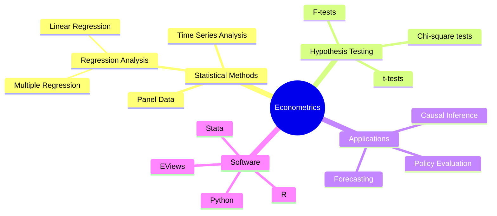

```mermaid
mindmap
  root((Econometrics))
    Statistical Methods
      Regression Analysis
        Linear Regression
        Multiple Regression
      Time Series Analysis
      Panel Data
    Hypothesis Testing
      t-tests
      F-tests
      Chi-square tests
    Applications
      Forecasting
      Policy Evaluation
      Causal Inference
    Software
      Stata
      R
      EViews
      Python
```

