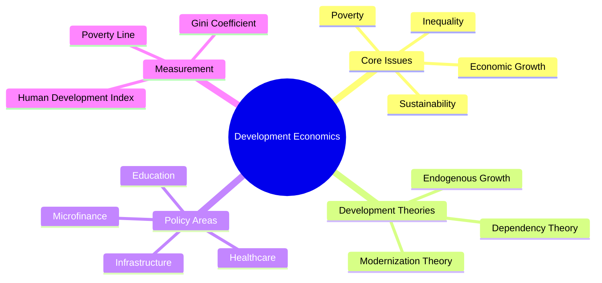

```mermaid
mindmap
  root((Development Economics))
    Core Issues
      Poverty
      Inequality
      Economic Growth
      Sustainability
    Development Theories
      Modernization Theory
      Dependency Theory
      Endogenous Growth
    Policy Areas
      Education
      Healthcare
      Infrastructure
      Microfinance
    Measurement
      Human Development Index
      Gini Coefficient
      Poverty Line
```

