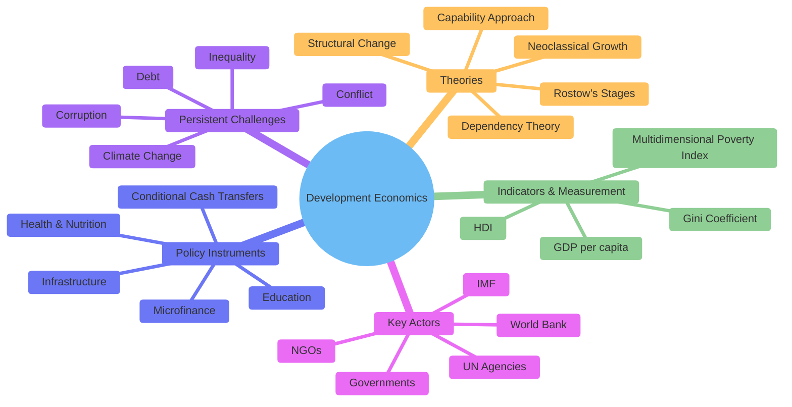

```mermaid
%%{init: {"theme": "base", "themeVariables": {
  "primaryColor": "#E3F2FD",
  "primaryTextColor": "#333",
  "primaryBorderColor": "#1565C0",
  "lineColor": "#4A6FA5",
  "secondaryColor": "#FFF3E0",
  "tertiaryColor": "#E8F5E9"
}}}%%
mindmap
  root((Development Economics))
    Theories
      Rostow’s Stages
      Structural Change
      Dependency Theory
      Capability Approach
      Neoclassical Growth
    Indicators & Measurement
      HDI
      Multidimensional Poverty Index
      Gini Coefficient
      GDP per capita
    Policy Instruments
      Education
      Health & Nutrition
      Infrastructure
      Microfinance
      Conditional Cash Transfers
    Persistent Challenges
      Inequality
      Corruption
      Conflict
      Climate Change
      Debt
    Key Actors
      Governments
      World Bank
      IMF
      UN Agencies
      NGOs
```

