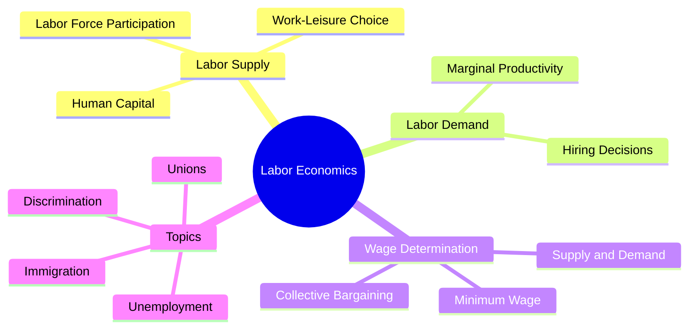

```mermaid
mindmap
  root((Labor Economics))
    Labor Supply
      Work-Leisure Choice
      Human Capital
      Labor Force Participation
    Labor Demand
      Marginal Productivity
      Hiring Decisions
    Wage Determination
      Supply and Demand
      Minimum Wage
      Collective Bargaining
    Topics
      Unemployment
      Discrimination
      Immigration
      Unions
```

