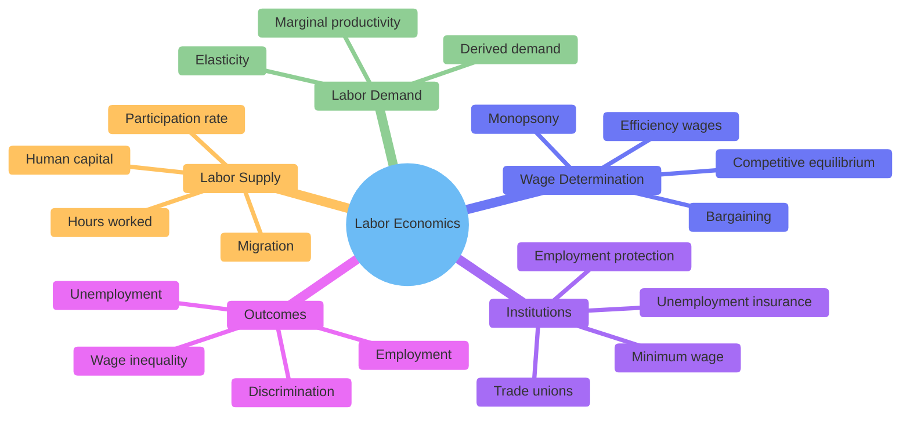

```mermaid
%%{init: {"theme": "base", "themeVariables": {
  "primaryColor": "#E3F2FD",
  "primaryTextColor": "#333",
  "primaryBorderColor": "#1565C0",
  "lineColor": "#4A6FA5",
  "secondaryColor": "#FFF3E0",
  "tertiaryColor": "#E8F5E9"
}}}%%
mindmap
  root((Labor Economics))
    Labor Supply
      Participation rate
      Hours worked
      Human capital
      Migration
    Labor Demand
      Marginal productivity
      Derived demand
      Elasticity
    Wage Determination
      Competitive equilibrium
      Monopsony
      Efficiency wages
      Bargaining
    Institutions
      Trade unions
      Minimum wage
      Unemployment insurance
      Employment protection
    Outcomes
      Employment
      Unemployment
      Wage inequality
      Discrimination
```

