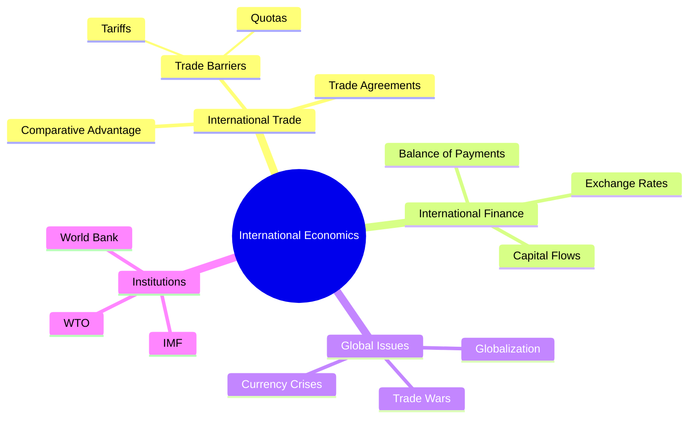

```mermaid
mindmap
  root((International Economics))
    International Trade
      Comparative Advantage
      Trade Barriers
        Tariffs
        Quotas
      Trade Agreements
    International Finance
      Exchange Rates
      Balance of Payments
      Capital Flows
    Global Issues
      Globalization
      Trade Wars
      Currency Crises
    Institutions
      WTO
      IMF
      World Bank
```

