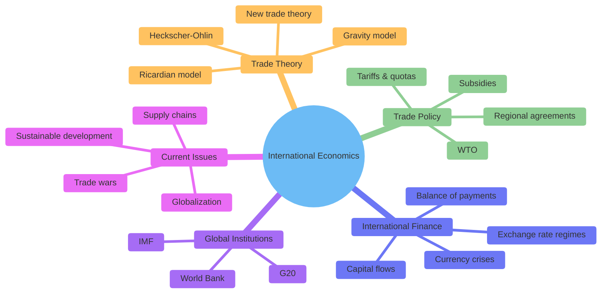

```mermaid
%%{init: {"theme": "base", "themeVariables": {
  "primaryColor": "#E3F2FD",
  "primaryTextColor": "#333",
  "primaryBorderColor": "#1565C0",
  "lineColor": "#4A6FA5",
  "secondaryColor": "#FFF3E0",
  "tertiaryColor": "#E8F5E9"
}}}%%
mindmap
  root((International Economics))
    Trade Theory
      Ricardian model
      Heckscher‑Ohlin
      New trade theory
      Gravity model
    Trade Policy
      Tariffs & quotas
      Subsidies
      Regional agreements
      WTO
    International Finance
      Exchange rate regimes
      Balance of payments
      Currency crises
      Capital flows
    Global Institutions
      IMF
      World Bank
      G20
    Current Issues
      Globalization
      Trade wars
      Supply chains
      Sustainable development
```

