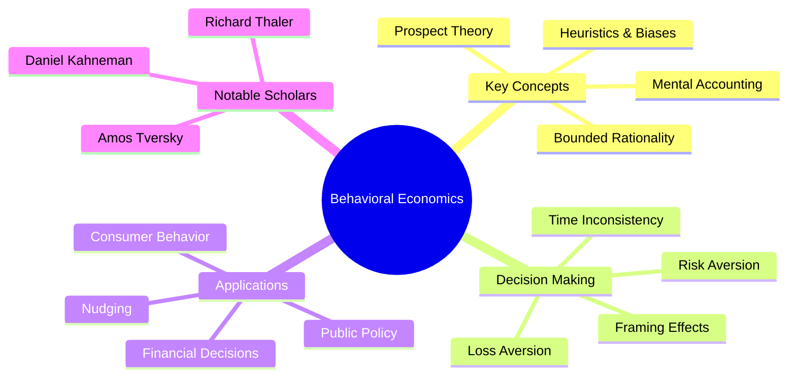

```mermaid
mindmap
  root((Behavioral Economics))
    Key Concepts
      Bounded Rationality
      Heuristics & Biases
      Prospect Theory
      Mental Accounting
    Decision Making
      Risk Aversion
      Loss Aversion
      Time Inconsistency
      Framing Effects
    Applications
      Nudging
      Consumer Behavior
      Financial Decisions
      Public Policy
    Notable Scholars
      Daniel Kahneman
      Richard Thaler
      Amos Tversky
```

