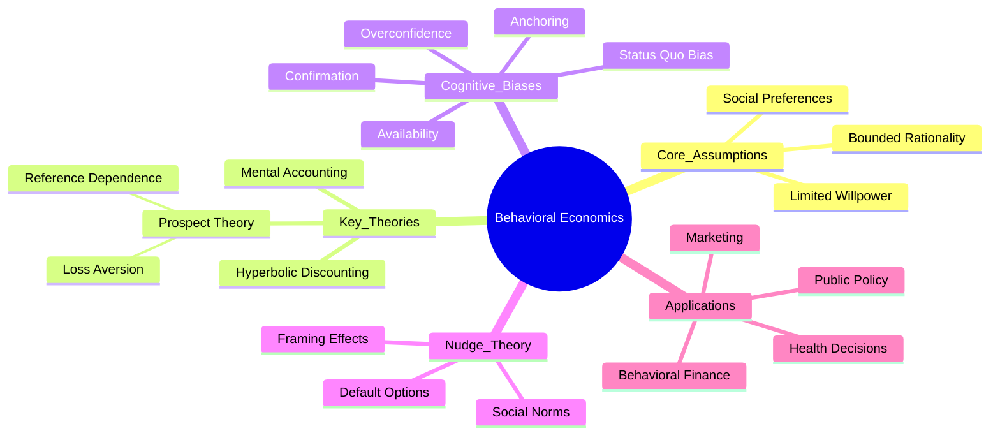

```mermaid
mindmap
  root((Behavioral Economics))
    Core_Assumptions
      Bounded Rationality
      Limited Willpower
      Social Preferences
    Key_Theories
      Prospect Theory
        Loss Aversion
        Reference Dependence
      Mental Accounting
      Hyperbolic Discounting
    Cognitive_Biases
      Anchoring
      Availability
      Confirmation
      Overconfidence
      Status Quo Bias
    Nudge_Theory
      Default Options
      Framing Effects
      Social Norms
    Applications
      Public Policy
      Behavioral Finance
      Health Decisions
      Marketing
```

