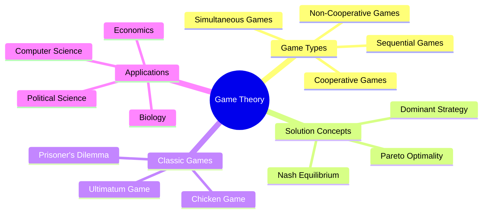

```mermaid
mindmap
  root((Game Theory))
    Game Types
      Cooperative Games
      Non-Cooperative Games
      Sequential Games
      Simultaneous Games
    Solution Concepts
      Nash Equilibrium
      Dominant Strategy
      Pareto Optimality
    Classic Games
      Prisoner's Dilemma
      Ultimatum Game
      Chicken Game
    Applications
      Economics
      Political Science
      Biology
      Computer Science
```

