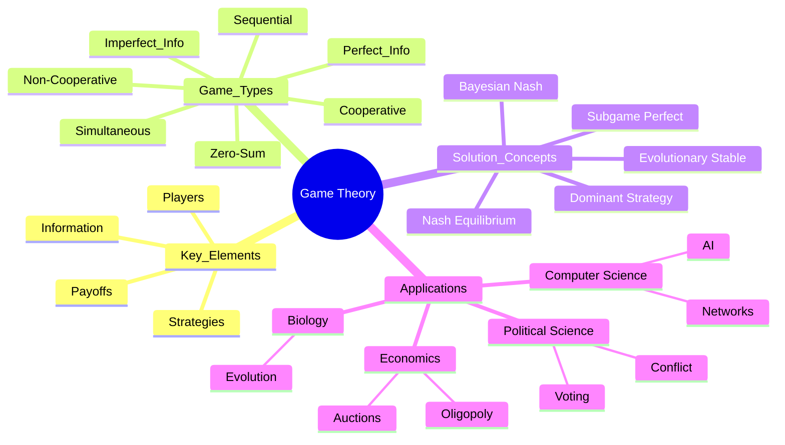

```mermaid
mindmap
  root((Game Theory))
    Key_Elements
      Players
      Strategies
      Payoffs
      Information
    Game_Types
      Cooperative
      Non-Cooperative
      Zero-Sum
      Simultaneous
      Sequential
      Perfect_Info
      Imperfect_Info
    Solution_Concepts
      Dominant Strategy
      Nash Equilibrium
      Subgame Perfect
      Bayesian Nash
      Evolutionary Stable
    Applications
      Economics
        Oligopoly
        Auctions
      Political Science
        Voting
        Conflict
      Biology
        Evolution
      Computer Science
        AI
        Networks
```

