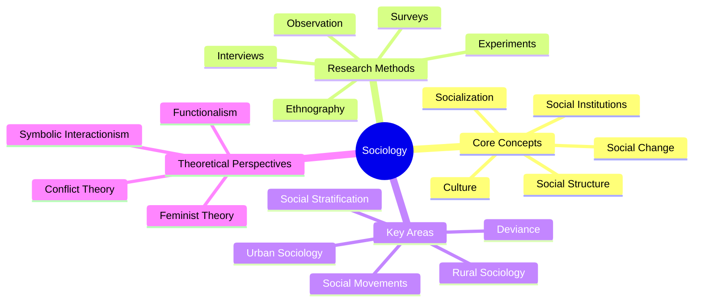

```mermaid
mindmap
  root((Sociology))
    Core Concepts
      Social Structure
      Social Institutions
      Socialization
      Culture
      Social Change
    Research Methods
      Surveys
      Interviews
      Observation
      Experiments
      Ethnography
    Key Areas
      Social Stratification
      Deviance
      Social Movements
      Urban Sociology
      Rural Sociology
    Theoretical Perspectives
      Functionalism
      Conflict Theory
      Symbolic Interactionism
      Feminist Theory
```

