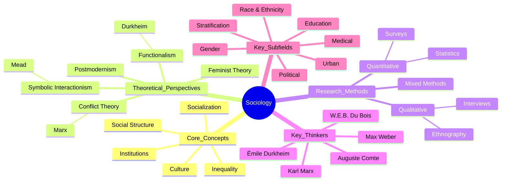

```mermaid
mindmap
  root((Sociology))
    Core_Concepts
      Social Structure
      Culture
      Socialization
      Inequality
      Institutions
    Theoretical_Perspectives
      Functionalism
        Durkheim
      Conflict Theory
        Marx
      Symbolic Interactionism
        Mead
      Feminist Theory
      Postmodernism
    Research_Methods
      Quantitative
        Surveys
        Statistics
      Qualitative
        Ethnography
        Interviews
      Mixed Methods
    Key_Thinkers
      Auguste Comte
      Karl Marx
      Émile Durkheim
      Max Weber
      W.E.B. Du Bois
    Key_Subfields
      Stratification
      Race & Ethnicity
      Gender
      Urban
      Medical
      Education
      Political
```

