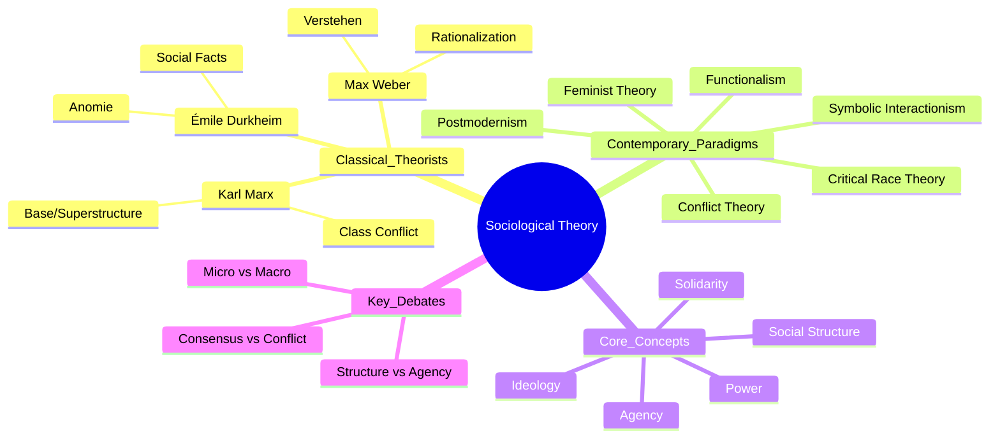

```mermaid
mindmap
  root((Sociological Theory))
    Classical_Theorists
      Karl Marx
        Class Conflict
        Base/Superstructure
      Émile Durkheim
        Social Facts
        Anomie
      Max Weber
        Verstehen
        Rationalization
    Contemporary_Paradigms
      Functionalism
      Conflict Theory
      Symbolic Interactionism
      Feminist Theory
      Critical Race Theory
      Postmodernism
    Core_Concepts
      Social Structure
      Agency
      Power
      Ideology
      Solidarity
    Key_Debates
      Structure vs Agency
      Micro vs Macro
      Consensus vs Conflict
```

