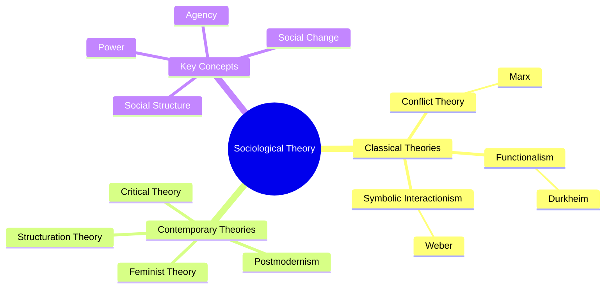

```mermaid
mindmap
  root((Sociological Theory))
    Classical Theories
      Functionalism
        Durkheim
      Conflict Theory
        Marx
      Symbolic Interactionism
        Weber
    Contemporary Theories
      Structuration Theory
      Postmodernism
      Feminist Theory
      Critical Theory
    Key Concepts
      Social Structure
      Agency
      Power
      Social Change
```

