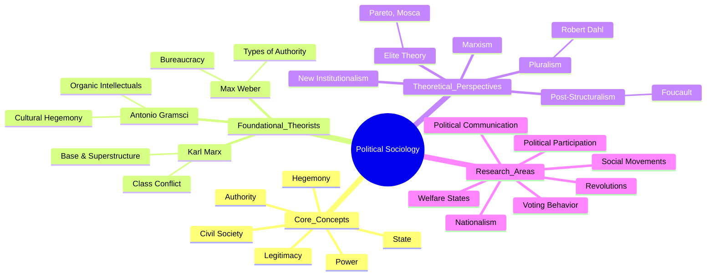

```mermaid
mindmap
  root((Political Sociology))
    Core_Concepts
      Power
      State
      Legitimacy
      Authority
      Civil Society
      Hegemony
    Foundational_Theorists
      Karl Marx
        Class Conflict
        Base & Superstructure
      Max Weber
        Types of Authority
        Bureaucracy
      Antonio Gramsci
        Cultural Hegemony
        Organic Intellectuals
    Theoretical_Perspectives
      Elite Theory
        Pareto, Mosca
      Pluralism
        Robert Dahl
      Marxism
      New Institutionalism
      Post-Structuralism
        Foucault
    Research_Areas
      Political Participation
      Social Movements
      Revolutions
      Voting Behavior
      Nationalism
      Welfare States
      Political Communication
```

