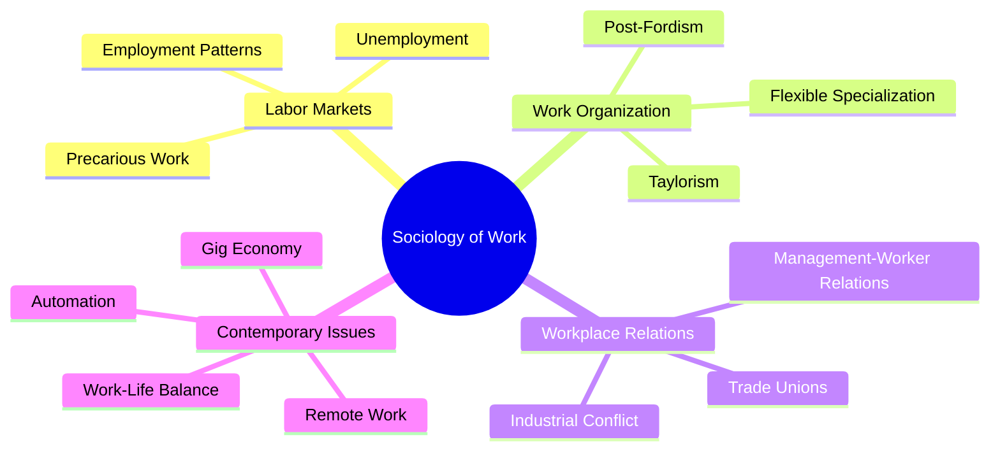

```mermaid
mindmap
  root((Sociology of Work))
    Labor Markets
      Employment Patterns
      Unemployment
      Precarious Work
    Work Organization
      Taylorism
      Post-Fordism
      Flexible Specialization
    Workplace Relations
      Management-Worker Relations
      Trade Unions
      Industrial Conflict
    Contemporary Issues
      Automation
      Gig Economy
      Work-Life Balance
      Remote Work
```

