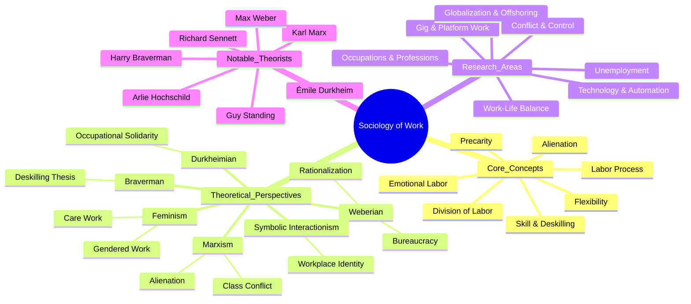

```mermaid
mindmap
  root((Sociology of Work))
    Core_Concepts
      Division of Labor
      Labor Process
      Alienation
      Skill & Deskilling
      Flexibility
      Precarity
      Emotional Labor
    Theoretical_Perspectives
      Marxism
        Alienation
        Class Conflict
      Weberian
        Bureaucracy
        Rationalization
      Durkheimian
        Occupational Solidarity
      Feminism
        Gendered Work
        Care Work
      Symbolic Interactionism
        Workplace Identity
      Braverman
        Deskilling Thesis
    Research_Areas
      Occupations & Professions
      Technology & Automation
      Gig & Platform Work
      Work-Life Balance
      Unemployment
      Globalization & Offshoring
      Conflict & Control
    Notable_Theorists
      Karl Marx
      Max Weber
      Émile Durkheim
      Harry Braverman
      Arlie Hochschild
      Richard Sennett
      Guy Standing
```

