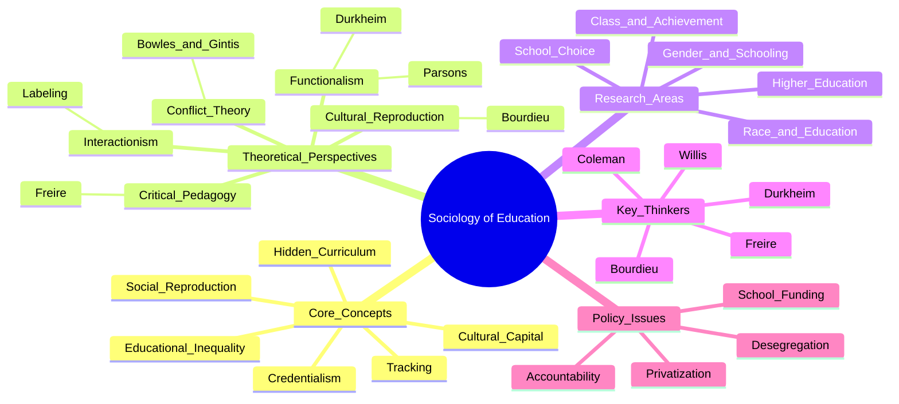

```mermaid
mindmap
  root((Sociology of Education))
    Core_Concepts
      Educational_Inequality
      Social_Reproduction
      Cultural_Capital
      Hidden_Curriculum
      Tracking
      Credentialism
    Theoretical_Perspectives
      Functionalism
        Durkheim
        Parsons
      Conflict_Theory
        Bowles_and_Gintis
      Interactionism
        Labeling
      Cultural_Reproduction
        Bourdieu
      Critical_Pedagogy
        Freire
    Research_Areas
      Class_and_Achievement
      Race_and_Education
      Gender_and_Schooling
      Higher_Education
      School_Choice
    Key_Thinkers
      Durkheim
      Bourdieu
      Coleman
      Freire
      Willis
    Policy_Issues
      School_Funding
      Desegregation
      Accountability
      Privatization
```

