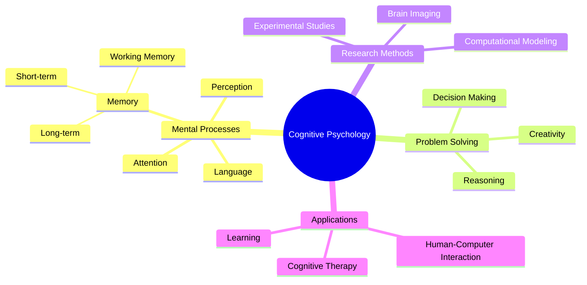

```mermaid
mindmap
  root((Cognitive Psychology))
    Mental Processes
      Perception
      Attention
      Memory
        Short-term
        Long-term
        Working Memory
      Language
    Problem Solving
      Reasoning
      Decision Making
      Creativity
    Research Methods
      Experimental Studies
      Brain Imaging
      Computational Modeling
    Applications
      Learning
      Human-Computer Interaction
      Cognitive Therapy
```

