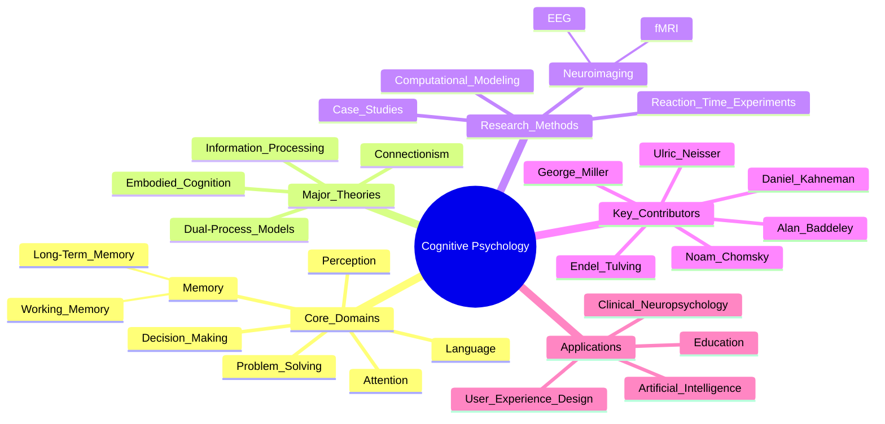

```mermaid
mindmap
  root((Cognitive Psychology))
    Core_Domains
      Perception
      Attention
      Memory
        Working_Memory
        Long-Term_Memory
      Language
      Problem_Solving
      Decision_Making
    Major_Theories
      Information_Processing
      Connectionism
      Embodied_Cognition
      Dual-Process_Models
    Research_Methods
      Reaction_Time_Experiments
      Neuroimaging
        fMRI
        EEG
      Computational_Modeling
      Case_Studies
    Key_Contributors
      Ulric_Neisser
      George_Miller
      Noam_Chomsky
      Endel_Tulving
      Alan_Baddeley
      Daniel_Kahneman
    Applications
      Education
      Artificial_Intelligence
      Clinical_Neuropsychology
      User_Experience_Design
```

