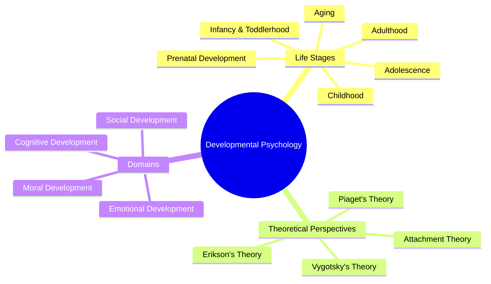

```mermaid
mindmap
  root((Developmental Psychology))
    Life Stages
      Prenatal Development
      Infancy & Toddlerhood
      Childhood
      Adolescence
      Adulthood
      Aging
    Theoretical Perspectives
      Piaget's Theory
      Erikson's Theory
      Vygotsky's Theory
      Attachment Theory
    Domains
      Cognitive Development
      Social Development
      Emotional Development
      Moral Development
```

