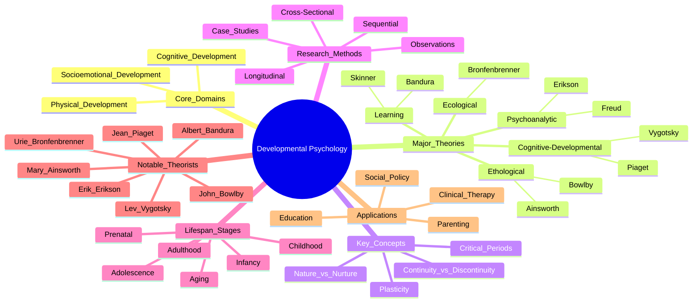

```mermaid
mindmap
  root((Developmental Psychology))
    Core_Domains
      Physical_Development
      Cognitive_Development
      Socioemotional_Development
    Major_Theories
      Psychoanalytic
        Freud
        Erikson
      Learning
        Skinner
        Bandura
      Cognitive-Developmental
        Piaget
        Vygotsky
      Ethological
        Bowlby
        Ainsworth
      Ecological
        Bronfenbrenner
    Key_Concepts
      Nature_vs_Nurture
      Continuity_vs_Discontinuity
      Critical_Periods
      Plasticity
    Research_Methods
      Longitudinal
      Cross-Sectional
      Sequential
      Case_Studies
      Observations
    Lifespan_Stages
      Prenatal
      Infancy
      Childhood
      Adolescence
      Adulthood
      Aging
    Notable_Theorists
      Jean_Piaget
      Lev_Vygotsky
      Erik_Erikson
      John_Bowlby
      Mary_Ainsworth
      Albert_Bandura
      Urie_Bronfenbrenner
    Applications
      Education
      Parenting
      Clinical_Therapy
      Social_Policy
```

