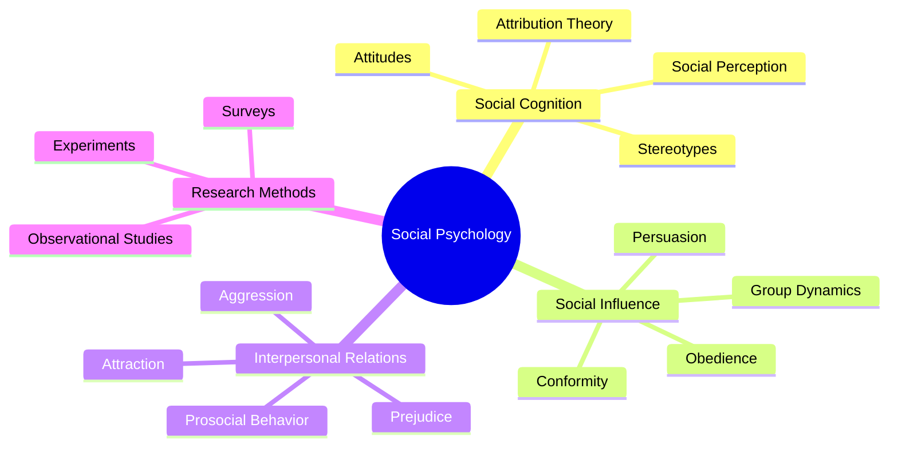

```mermaid
mindmap
  root((Social Psychology))
    Social Cognition
      Attitudes
      Stereotypes
      Attribution Theory
      Social Perception
    Social Influence
      Conformity
      Obedience
      Persuasion
      Group Dynamics
    Interpersonal Relations
      Attraction
      Prejudice
      Aggression
      Prosocial Behavior
    Research Methods
      Experiments
      Surveys
      Observational Studies
```

