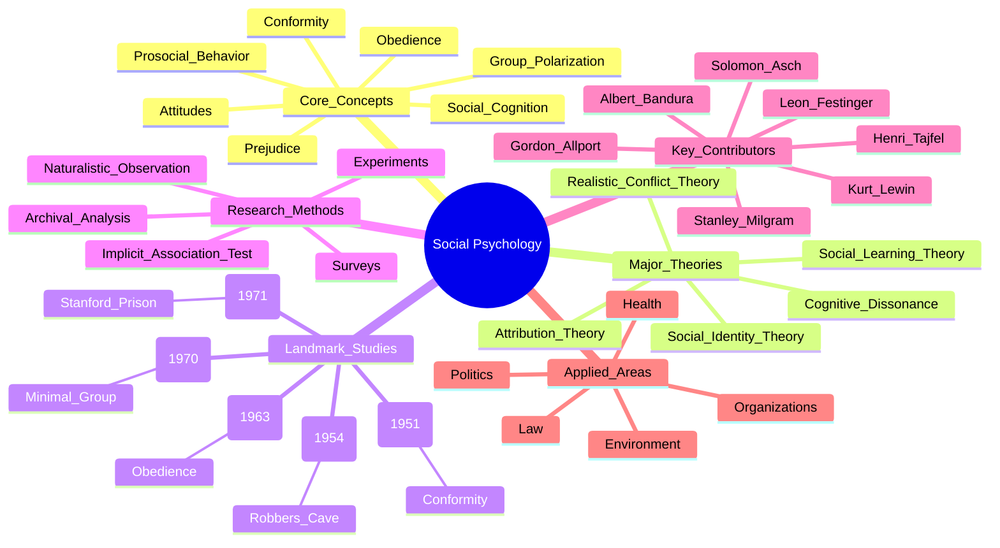

```mermaid
mindmap
  root((Social Psychology))
    Core_Concepts
      Social_Cognition
      Attitudes
      Conformity
      Obedience
      Group_Polarization
      Prejudice
      Prosocial_Behavior
    Major_Theories
      Attribution_Theory
      Cognitive_Dissonance
      Social_Identity_Theory
      Social_Learning_Theory
      Realistic_Conflict_Theory
    Landmark_Studies
      Asch_(1951)
        Conformity
      Milgram_(1963)
        Obedience
      Zimbardo_(1971)
        Stanford_Prison
      Sherif_(1954)
        Robbers_Cave
      Tajfel_(1970)
        Minimal_Group
    Research_Methods
      Experiments
      Surveys
      Naturalistic_Observation
      Archival_Analysis
      Implicit_Association_Test
    Key_Contributors
      Gordon_Allport
      Kurt_Lewin
      Leon_Festinger
      Solomon_Asch
      Stanley_Milgram
      Albert_Bandura
      Henri_Tajfel
    Applied_Areas
      Health
      Organizations
      Law
      Environment
      Politics
```

