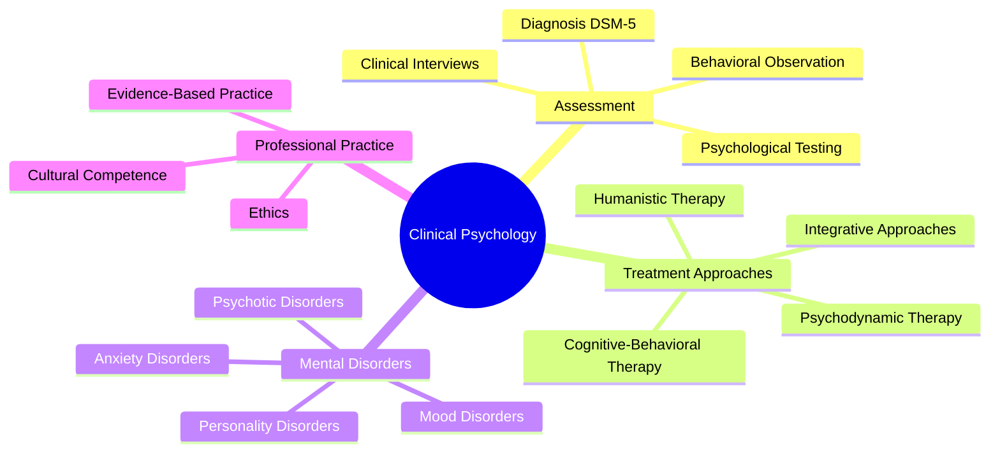

```mermaid
mindmap
  root((Clinical Psychology))
    Assessment
      Psychological Testing
      Clinical Interviews
      Behavioral Observation
      Diagnosis DSM-5
    Treatment Approaches
      Cognitive-Behavioral Therapy
      Psychodynamic Therapy
      Humanistic Therapy
      Integrative Approaches
    Mental Disorders
      Anxiety Disorders
      Mood Disorders
      Personality Disorders
      Psychotic Disorders
    Professional Practice
      Ethics
      Evidence-Based Practice
      Cultural Competence
```

