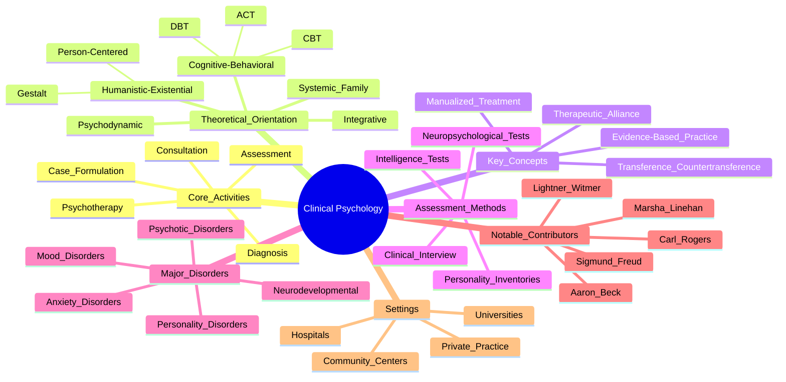

```mermaid
mindmap
  root((Clinical Psychology))
    Core_Activities
      Assessment
      Diagnosis
      Case_Formulation
      Psychotherapy
      Consultation
    Theoretical_Orientation
      Cognitive-Behavioral
        CBT
        ACT
        DBT
      Psychodynamic
      Humanistic-Existential
        Person-Centered
        Gestalt
      Systemic_Family
      Integrative
    Key_Concepts
      Evidence-Based_Practice
      Therapeutic_Alliance
      Transference_Countertransference
      Manualized_Treatment
    Assessment_Methods
      Clinical_Interview
      Intelligence_Tests
      Personality_Inventories
      Neuropsychological_Tests
    Major_Disorders
      Mood_Disorders
      Anxiety_Disorders
      Psychotic_Disorders
      Personality_Disorders
      Neurodevelopmental
    Notable_Contributors
      Lightner_Witmer
      Sigmund_Freud
      Aaron_Beck
      Carl_Rogers
      Marsha_Linehan
    Settings
      Hospitals
      Private_Practice
      Universities
      Community_Centers
```

