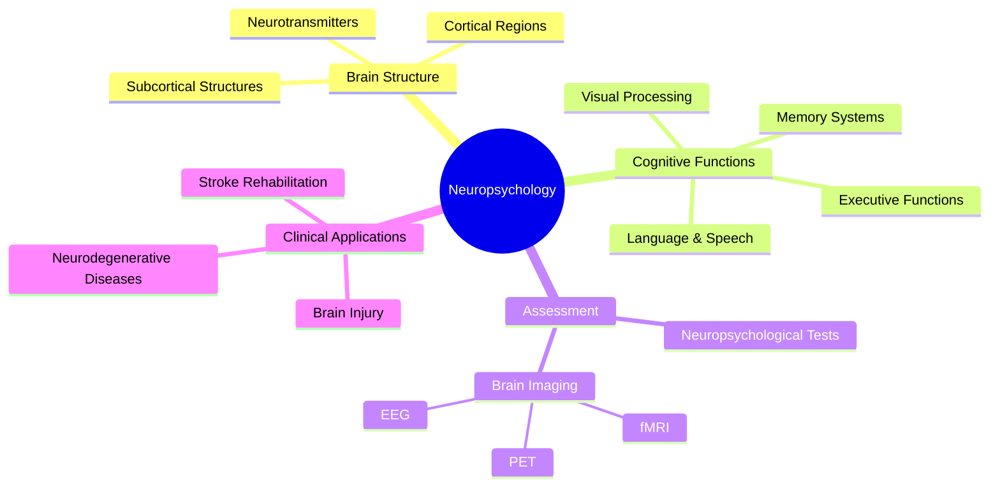

```mermaid
mindmap
  root((Neuropsychology))
    Brain Structure
      Cortical Regions
      Subcortical Structures
      Neurotransmitters
    Cognitive Functions
      Memory Systems
      Executive Functions
      Language & Speech
      Visual Processing
    Assessment
      Neuropsychological Tests
      Brain Imaging
        fMRI
        PET
        EEG
    Clinical Applications
      Brain Injury
      Neurodegenerative Diseases
      Stroke Rehabilitation
```

