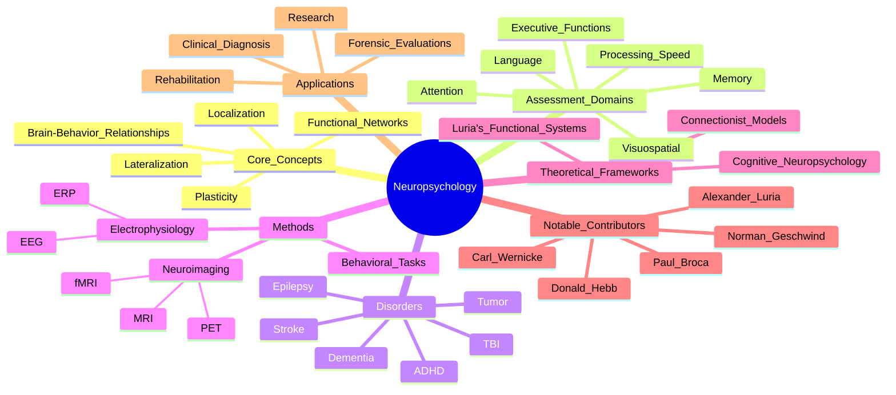

```mermaid
mindmap
  root((Neuropsychology))
    Core_Concepts
      Brain‑Behavior_Relationships
      Localization
      Lateralization
      Plasticity
      Functional_Networks
    Assessment_Domains
      Memory
      Attention
      Executive_Functions
      Language
      Visuospatial
      Processing_Speed
    Disorders
      TBI
      Stroke
      Dementia
      Epilepsy
      ADHD
      Tumor
    Methods
      Neuroimaging
        MRI
        fMRI
        PET
      Electrophysiology
        EEG
        ERP
      Behavioral_Tasks
    Theoretical_Frameworks
      Cognitive_Neuropsychology
      Luria's_Functional_Systems
      Connectionist_Models
    Notable_Contributors
      Paul_Broca
      Carl_Wernicke
      Alexander_Luria
      Donald_Hebb
      Norman_Geschwind
    Applications
      Clinical_Diagnosis
      Rehabilitation
      Forensic_Evaluations
      Research
```

