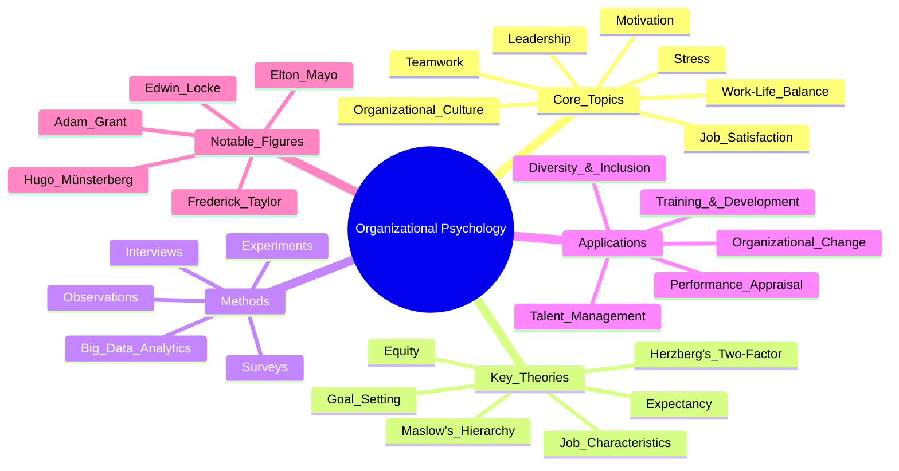

```mermaid
mindmap
  root((Organizational Psychology))
    Core_Topics
      Job_Satisfaction
      Motivation
      Leadership
      Teamwork
      Organizational_Culture
      Stress
      Work-Life_Balance
    Key_Theories
      Maslow's_Hierarchy
      Herzberg's_Two-Factor
      Goal_Setting
      Expectancy
      Equity
      Job_Characteristics
    Methods
      Surveys
      Experiments
      Interviews
      Observations
      Big_Data_Analytics
    Applications
      Talent_Management
      Training_&_Development
      Performance_Appraisal
      Organizational_Change
      Diversity_&_Inclusion
    Notable_Figures
      Hugo_Münsterberg
      Frederick_Taylor
      Elton_Mayo
      Edwin_Locke
      Adam_Grant
```

