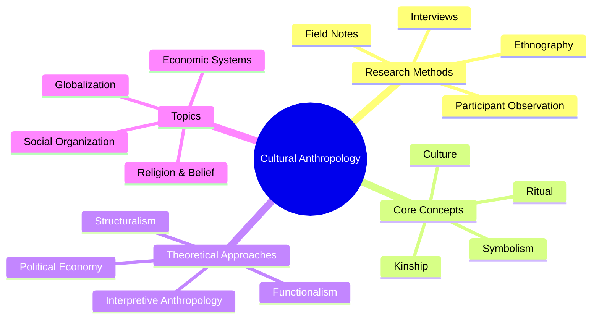

```mermaid
mindmap
  root((Cultural Anthropology))
    Research Methods
      Ethnography
      Participant Observation
      Interviews
      Field Notes
    Core Concepts
      Culture
      Kinship
      Ritual
      Symbolism
    Theoretical Approaches
      Functionalism
      Structuralism
      Interpretive Anthropology
      Political Economy
    Topics
      Religion & Belief
      Economic Systems
      Social Organization
      Globalization
```

