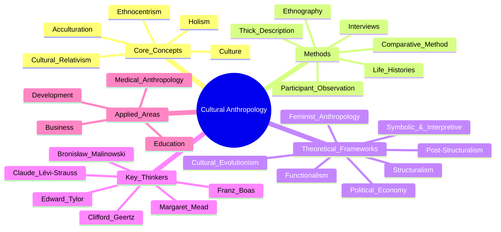

```mermaid
mindmap
  root((Cultural Anthropology))
    Core_Concepts
      Culture
      Cultural_Relativism
      Holism
      Ethnocentrism
      Acculturation
    Methods
      Ethnography
      Participant_Observation
      Interviews
      Life_Histories
      Comparative_Method
      Thick_Description
    Theoretical_Frameworks
      Cultural_Evolutionism
      Functionalism
      Structuralism
      Symbolic_&_Interpretive
      Political_Economy
      Post-Structuralism
      Feminist_Anthropology
    Key_Thinkers
      Edward_Tylor
      Franz_Boas
      Bronisław_Malinowski
      Claude_Lévi-Strauss
      Margaret_Mead
      Clifford_Geertz
    Applied_Areas
      Medical_Anthropology
      Development
      Education
      Business
```

