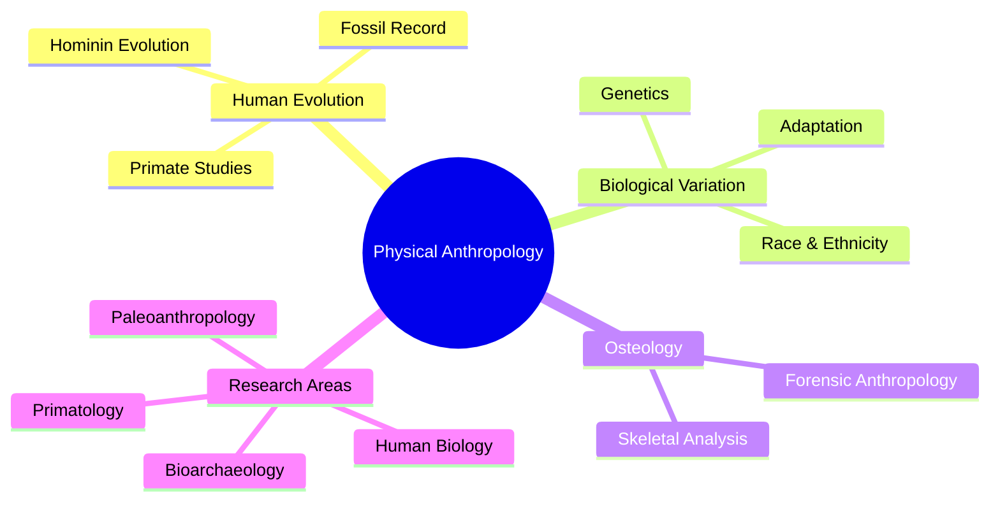

```mermaid
mindmap
  root((Physical Anthropology))
    Human Evolution
      Primate Studies
      Fossil Record
      Hominin Evolution
    Biological Variation
      Genetics
      Adaptation
      Race & Ethnicity
    Osteology
      Skeletal Analysis
      Forensic Anthropology
    Research Areas
      Paleoanthropology
      Primatology
      Human Biology
      Bioarchaeology
```

