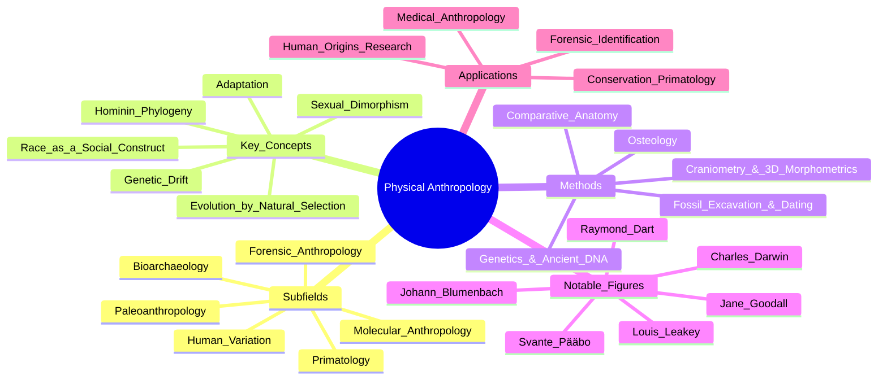

```mermaid
mindmap
  root((Physical Anthropology))
    Subfields
      Paleoanthropology
      Primatology
      Human_Variation
      Bioarchaeology
      Forensic_Anthropology
      Molecular_Anthropology
    Key_Concepts
      Evolution_by_Natural_Selection
      Adaptation
      Hominin_Phylogeny
      Race_as_a_Social_Construct
      Genetic_Drift
      Sexual_Dimorphism
    Methods
      Fossil_Excavation_&_Dating
      Comparative_Anatomy
      Genetics_&_Ancient_DNA
      Osteology
      Craniometry_&_3D_Morphometrics
    Notable_Figures
      Johann_Blumenbach
      Charles_Darwin
      Raymond_Dart
      Louis_Leakey
      Jane_Goodall
      Svante_Pääbo
    Applications
      Human_Origins_Research
      Forensic_Identification
      Medical_Anthropology
      Conservation_Primatology
```

