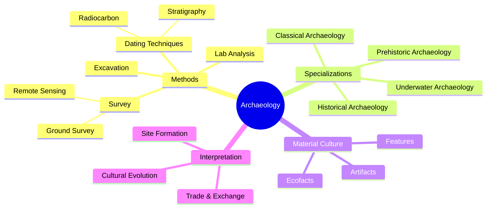

```mermaid
mindmap
  root((Archaeology))
    Methods
      Survey
        Remote Sensing
        Ground Survey
      Excavation
      Dating Techniques
        Radiocarbon
        Stratigraphy
      Lab Analysis
    Specializations
      Prehistoric Archaeology
      Historical Archaeology
      Classical Archaeology
      Underwater Archaeology
    Material Culture
      Artifacts
      Ecofacts
      Features
    Interpretation
      Site Formation
      Cultural Evolution
      Trade & Exchange
```

