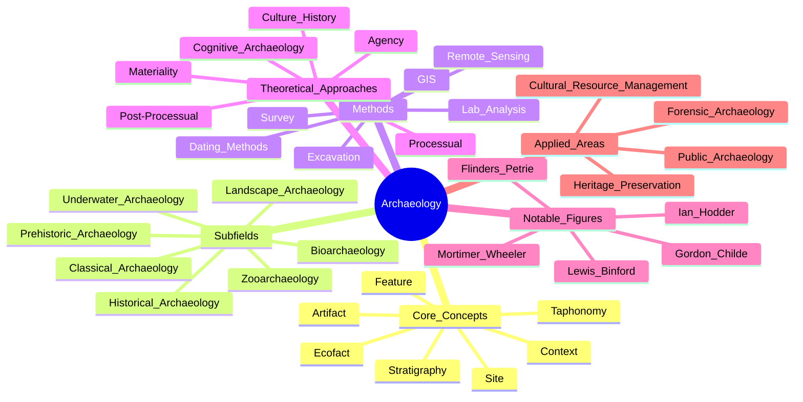

```mermaid
mindmap
  root((Archaeology))
    Core_Concepts
      Stratigraphy
      Context
      Artifact
      Ecofact
      Feature
      Site
      Taphonomy
    Subfields
      Prehistoric_Archaeology
      Historical_Archaeology
      Classical_Archaeology
      Underwater_Archaeology
      Bioarchaeology
      Zooarchaeology
      Landscape_Archaeology
    Methods
      Survey
      Excavation
      GIS
      Remote_Sensing
      Dating_Methods
      Lab_Analysis
    Theoretical_Approaches
      Culture_History
      Processual
      Post-Processual
      Agency
      Materiality
      Cognitive_Archaeology
    Notable_Figures
      Flinders_Petrie
      Mortimer_Wheeler
      Gordon_Childe
      Lewis_Binford
      Ian_Hodder
    Applied_Areas
      Cultural_Resource_Management
      Heritage_Preservation
      Public_Archaeology
      Forensic_Archaeology
```

