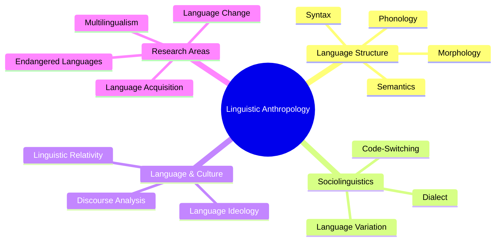

```mermaid
mindmap
  root((Linguistic Anthropology))
    Language Structure
      Phonology
      Morphology
      Syntax
      Semantics
    Sociolinguistics
      Language Variation
      Dialect
      Code-Switching
    Language & Culture
      Linguistic Relativity
      Language Ideology
      Discourse Analysis
    Research Areas
      Language Acquisition
      Endangered Languages
      Multilingualism
      Language Change
```

