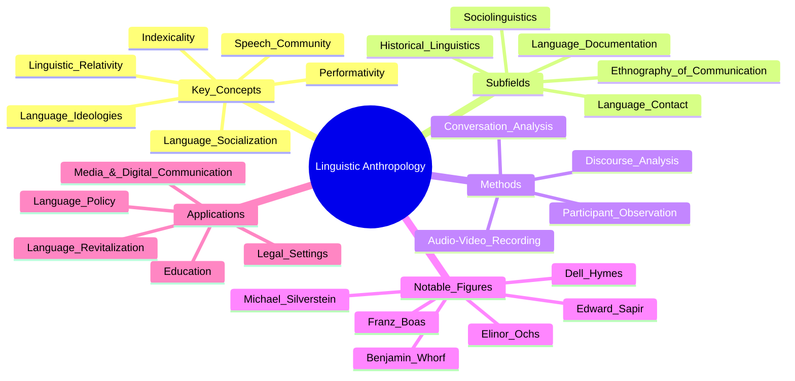

```mermaid
mindmap
  root((Linguistic Anthropology))
    Key_Concepts
      Linguistic_Relativity
      Indexicality
      Language_Socialization
      Speech_Community
      Language_Ideologies
      Performativity
    Subfields
      Ethnography_of_Communication
      Sociolinguistics
      Historical_Linguistics
      Language_Contact
      Language_Documentation
    Methods
      Participant_Observation
      Audio-Video_Recording
      Conversation_Analysis
      Discourse_Analysis
    Notable_Figures
      Franz_Boas
      Edward_Sapir
      Benjamin_Whorf
      Dell_Hymes
      Michael_Silverstein
      Elinor_Ochs
    Applications
      Language_Policy
      Education
      Legal_Settings
      Media_&_Digital_Communication
      Language_Revitalization
```

