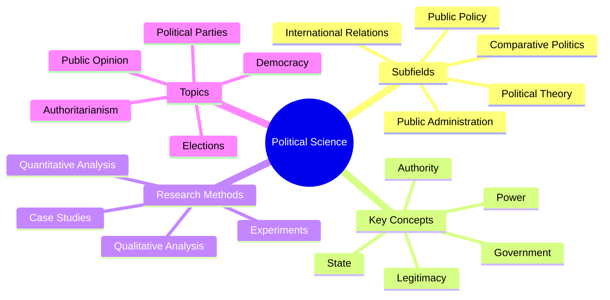

```mermaid
mindmap
  root((Political Science))
    Subfields
      Political Theory
      Comparative Politics
      International Relations
      Public Administration
      Public Policy
    Key Concepts
      Power
      Authority
      Legitimacy
      State
      Government
    Research Methods
      Quantitative Analysis
      Qualitative Analysis
      Case Studies
      Experiments
    Topics
      Democracy
      Authoritarianism
      Political Parties
      Elections
      Public Opinion
```

