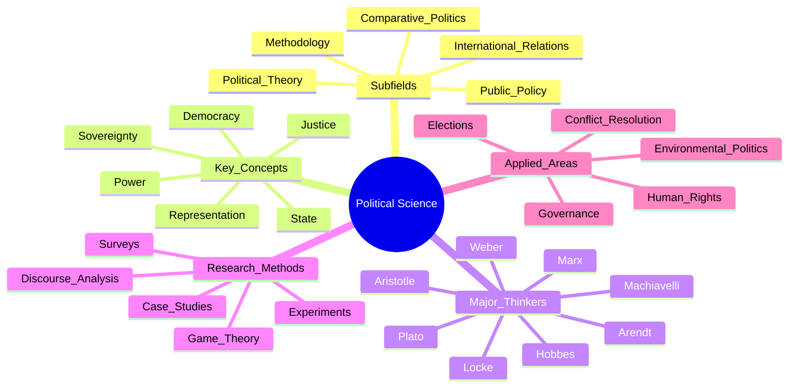

```mermaid
mindmap
  root((Political Science))
    Subfields
      Political_Theory
      Comparative_Politics
      International_Relations
      Public_Policy
      Methodology
    Key_Concepts
      Power
      State
      Sovereignty
      Democracy
      Justice
      Representation
    Major_Thinkers
      Plato
      Aristotle
      Machiavelli
      Hobbes
      Locke
      Marx
      Weber
      Arendt
    Research_Methods
      Case_Studies
      Surveys
      Experiments
      Game_Theory
      Discourse_Analysis
    Applied_Areas
      Governance
      Elections
      Conflict_Resolution
      Human_Rights
      Environmental_Politics
```

