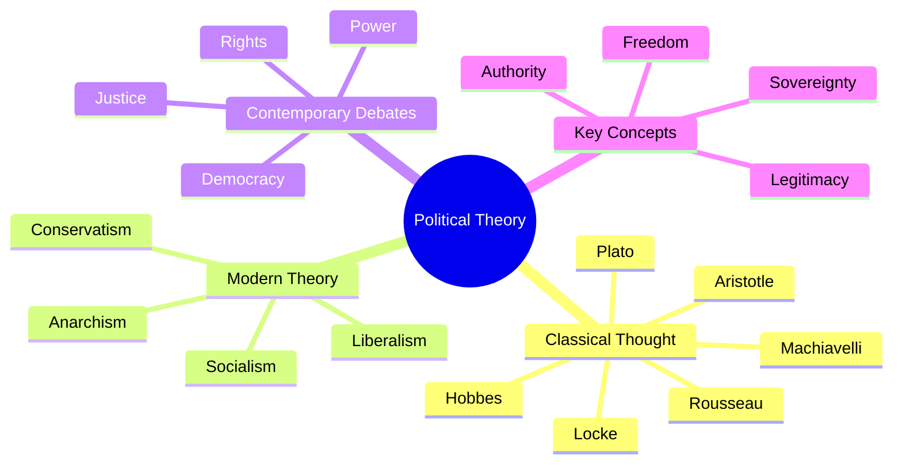

```mermaid
mindmap
  root((Political Theory))
    Classical Thought
      Plato
      Aristotle
      Machiavelli
      Hobbes
      Locke
      Rousseau
    Modern Theory
      Liberalism
      Conservatism
      Socialism
      Anarchism
    Contemporary Debates
      Justice
      Democracy
      Rights
      Power
    Key Concepts
      Sovereignty
      Legitimacy
      Authority
      Freedom
```

